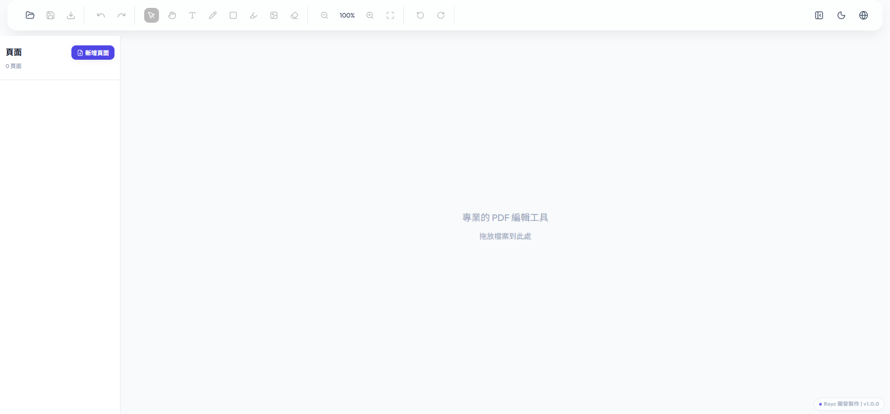

<p align="center">
  
</p>

<h1 align="center">PDF 編輯器</h1>
<p align="center">在瀏覽器裡編輯 PDF：上傳、預覽、改字、畫線、插圖、旋轉頁面，所見即所得匯出。</p>

<p align="center">
  
  
  
</p>

---

<br />

## ✨ 特色

<table>
<tr>
<td width="50%">

**🎨 介面**
- 漸層配色、深/淺色主題
- 動畫過場、響應式版面

**🌍 語言**
- 繁體中文 · 簡體中文 · English · Tiếng Việt

</td>
<td width="50%">

**📝 編輯**
- 文字（含點擊原文編輯）、繪圖、形狀
- 高亮、註解、圖片、橡皮擦
- 頁面旋轉/刪除/排序、撤銷/重做

**🔄 轉換**
- PDF ↔ 圖片 · 圖片→PDF · 合併 · 分割

</td>
</tr>
</table>

<br />

## 🚀 快速開始

```bash
cd pdf-editor-web
npm install
npm run dev
```

在瀏覽器開啟 **http://localhost:5173**。

建置正式版：`npm run build`

<br />

## 📖 使用說明

### 基本流程

| 步驟 | 說明 |
|------|------|
| 1️⃣ 開啟 | 工具列「開啟」→ 選擇 PDF |
| 2️⃣ 頁面 | 左側縮圖切換頁面 |
| 3️⃣ 縮放 | 放大/縮小、「符合頁面」 |
| 4️⃣ 工具 | 選取、文字、繪圖、形狀、高亮、註解、圖片、橡皮擦 |
| 5️⃣ 儲存 | 「儲存」→ 自動下載編輯後 PDF |

### 文字編輯（點擊既有文字）

用 **文字** 或 **選取** 工具點擊 PDF 上的字時：

| 項目 | 編輯器 | 匯出 |
|------|--------|------|
| 被取代的原文 | 白底蓋住 | 白底 + 新字 |
| 你輸入的新字 | 半透明紅底標示 | 即為新內容 |

💡 **旋轉頁面時**：先旋轉再輸入文字或插圖，匯出時會自動配合頁面方向，維持正常閱讀。

### 其他

- **格式轉換**：工具列「轉換」→ 選類型 → 上傳 → 轉換 → 下載  
- **語言 / 主題 / 側邊欄**：工具列對應圖標  

<br />

## 🛠 技術

- **前端**：React 18 · TypeScript · Vite  
- **PDF**：PDF.js（渲染）、pdf-lib（編輯/匯出）  
- **狀態**：Zustand · **多語**：i18next · **動畫**：Framer Motion  

```
src/
├── components/   Editor, Tools, UI, Converter
├── lib/          pdf-renderer, pdf-editor, pdf-converter
├── locales/      翻譯
├── store/
└── App.tsx
```

<br />

## 📌 開發狀態

- ✅ 架構、多語、主題、PDF 渲染/編輯/轉換、各類編輯工具、原生點擊改字、旋轉與匯出一致  
- 🔜 拖放上傳、PWA、桌面版 (Electron)

---

## 📝 版本更新記錄

### v1.0.2 (2026-02-12)

**修復與改進**：
- ✅ 修復 `updateAnnotation` 歷史記錄問題：修改標註後可正常撤銷/重做
- ✅ 修復雙擊文字標註無法開啟編輯器的問題
- ✅ 優化字型載入路徑：支援多種環境（開發/生產/Electron），中文顯示更穩定
- ✅ 清理開發環境 console.log：生產環境無 debug 訊息
- ✅ 支援標準字型（英文）粗體/斜體匯出
- ✅ 移除 ENGINE MONITOR debug 面板

**已知限制**：
- ⚠️ CJK 字型（中文）粗體暫時無法支援（變數字型限制，需額外實作）

### v1.0.0 (2026-02-11)

**正式版發布**：
- ✅ 完整的 PDF 編輯功能
- ✅ 原生點擊改字、白底/紅框同步
- ✅ 頁面旋轉與匯出方向一致  
